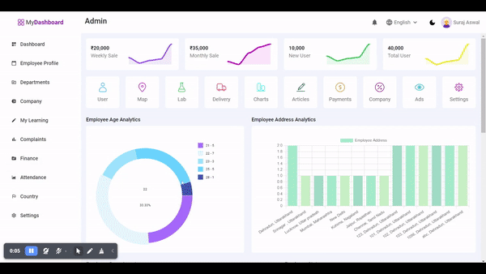

<h1>MERN Dashboard</h1>

The Objective of this Web Application is to perform CRUD operation by using MongoDB as Database and Node.js and Express as backend, and retrive and visualize the data in various interactive forms such as Spark Line Graphs, Bar Graph, Pie Chart, Donut Chart etc.

Dashboard Demo URL : https://mern-dashboard-buke.onrender.com

<h2>Features</h2>
<ul>
  <li>SparkLine Data Visualization</li>
   <li>Bar Graph Visualization</li>
    <li>Pie Charts Visualization</li>
     <li>Donut Data Visualization</li>
      <li>SideBar with various links</li>
       <li>Top Bar with various feature boxes</li>
        <li>Dark or Light Theme Setter</li>
        <li>Google map and Geocoding API Integration</li>
         <li>Data Table, clicking on each table row shows the data in a popup with a map pointing the location. </li>
</ul>

<h3>Sneak Peek</h3>

<h3>Google Map and Geocoding API Inetgration</h3>

